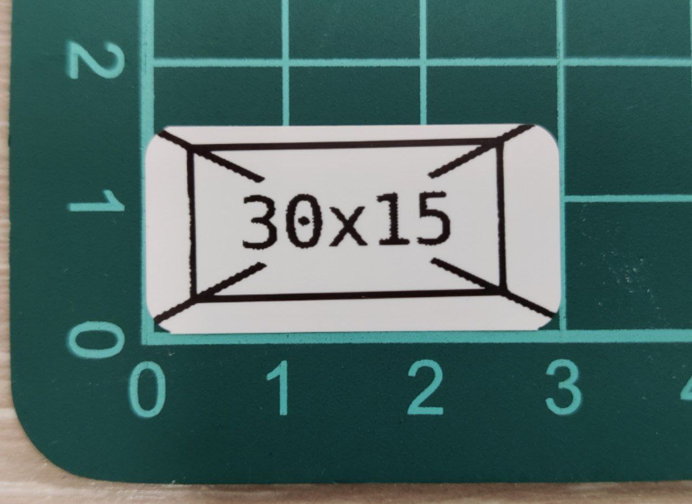
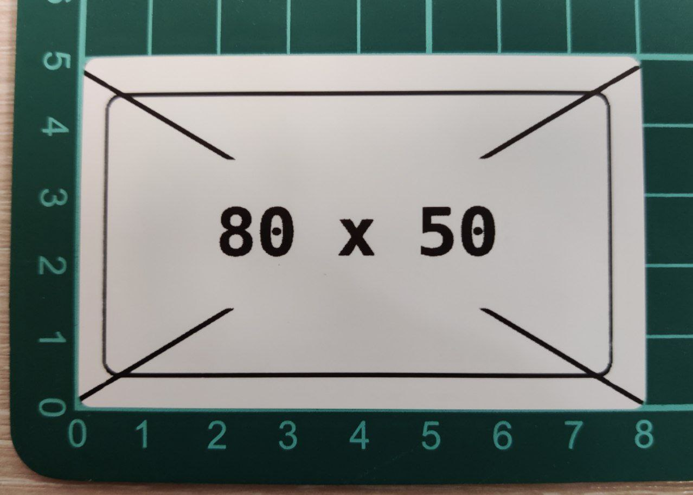

---
hide:
  - navigation
  - toc
---

# Niimbot Printer Client

## Installation

Recommended method is to use [poetry](https://python-poetry.org) and install with `poetry install`.
However `requirements.txt` is also provided for convenience.

Project is tested on Python 3.11, but should work on other versions.

## Usage

Just run `niimprint --help`

### Print and tape notes

* `TT14*50` is prone to overfeeding. Roll it for 1.5mm back after each printed label.
* «Bubble B» stickers have variable dimensions and colors (green, blue, teal, pink, yellow — in that order).
  Be careful with layouts.
* Almost all stickers have rounded corners, count it when designing layouts.
* Note that different print densities will vary the pixel size, so count at least 2-5 pixels from the edges
  to avoid clipping.
* **Always** use good dithering (Floyd-Steinberg, Sierra, Burkes) for grayscale images.

## Examples

### B21, USB connection, 30x15 mm (240x120 px) label

```
python niimprint -c usb -a /dev/ttyACM0 -r 90 -i examples/B21_30x15mm_240x120px.png
```



### B21, Bluetooth connection, 80x50 mm (640x384 px) label

```
python niimprint -c bluetooth -a "E2:E1:08:03:09:87" -r 90 -i examples/B21_80x50mm_640x384px.png
```




## USB connection

For USB connection, you can omit the `--addr` argument and let the script auto-detect the serial port.
However, it will fail if there're multiple available ports.

On linux, serial ports can be found at `/dev/ttyUSB*`, `/dev/ttyACM*` or `/dev/serial/*`. 
On windows, they will be named like `COM1`, `COM2` etc. Check the device manager to choose the correct one.

## Bluetooth connection

It seems like B21 (and maybe other models?) has two bluetooth addresses.
For me, they start with `C2:E1` and `E2:E1` respectively. 

!!! warning "Double-check bluetooth address"

    Connection works only if you disconnect from `C2:E1` and connect to `E2:E1`.

Also after connecting to `E2:E1` via bluetoothctl I always get `org.bluez.Error.NotAvailable br-connection-profile-unavailable` error, but printing works fine regardless.
