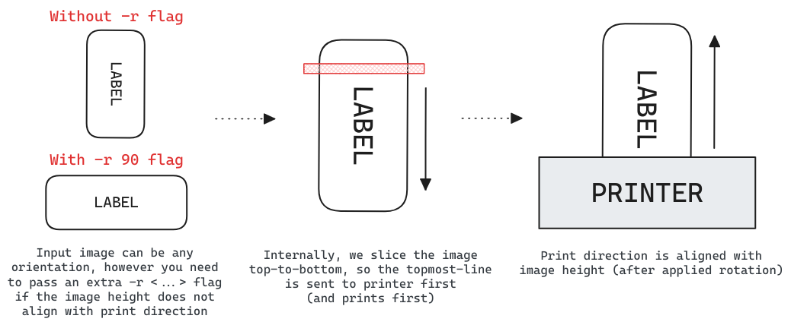

# `niimprint` &mdash; Niimbot Printer Client

**Fork changelog & differences from original version:**

- Tested on Niimbot B21 and Python 3.11. Niimbot D11 support may be broken!
- Added transport abstraction: switch between bluetooth and USB (serial)
- Disabled checksum calculation for image encoding (works fine without it so far)
- Switched to [click](https://click.palletsprojects.com/) CLI library instead of argparse
- Integrated [pyproject.toml](https://pip.pypa.io/en/stable/reference/build-system/pyproject-toml/) and [poetry](https://python-poetry.org)
- Integrated [pre-commit](https://pre-commit.com/) and [ruff](https://docs.astral.sh/ruff/), re-formatted all files
- Miscellaneous refactoring / file renaming / etc.

## Installation

Recommended method is to use [poetry](https://python-poetry.org) and install with `poetry install`. However `requirements.txt` is also provided for convenience. Project is tested on Python 3.11, but should work on other versions.

## Usage

```
$ python niimprint --help

Usage: niimprint [OPTIONS]

Options:
  -m, --model [b1|b18|b21|d11]     Niimbot printer model  [default: b21]
  -c, --conn [usb|bluetooth]   Connection type  [default: usb]
  -a, --addr TEXT              Bluetooth MAC address OR serial device path
  -d, --density INTEGER RANGE  Print density  [default: 5; 1<=x<=5]
  -r, --rotate [0|90|180|270]  Image rotation (clockwise)  [default: 0]
  -i, --image PATH             Image path  [required]
  -v, --verbose                Enable verbose logging
  --help                       Show this message and exit.
```

### Image orientation:

Generally, the image comes out of the printer with the same orientation you see it on your screen. You can have your input image rotated as you like, but adjust its orientation by passing `-r <...>` flag. See the image below for clarification.

[]()

<!-- Excalidraw link: https://excalidraw.com/#json=vYHMBohMn5GeB-5M6SNch,TsxRmh_WKUfzYjL183FGfg -->

### Image resolution:

As far as we've tested, Niimbot printers have **8 pixels per mm** (~203 dpi) resolution. The CLI prints the image you provided as-is, without any checks of the actual label size, so be careful. However the script will check if the image width is too big for selected printer. The maximum width in pixels is usually slightly less than specified maximum width in mm:

- **B21, B1, B18**: max 384 pixels (almost equal to 50 mm * 8 px/mm = 400)
- **D11**: max 96 pixels (almost equal to 15 mm * 8 px/mm = 120)

### USB connection:

For USB connection, you can omit the `--addr` argument and let the script auto-detect the serial port. However, it will fail if there're multiple available ports. On linux, serial ports can be found at `/dev/ttyUSB*`, `/dev/ttyACM*` or `/dev/serial/*`. On windows, they will be named like `COM1`, `COM2` etc. Check the device manager to choose the correct one.

### Bluetooth connection:

It seems like B21 (and maybe other models?) has two bluetooth adresses. For me, they start with `C2:E1` and `E2:E1` respectively. Connection works only if you disconnect from `C2:E1` and connect to `E2:E1`. Also after connecting to `E2:E1` via bluetoothctl I always get `org.bluez.Error.NotAvailable br-connection-profile-unavailable` error, but printing works fine regardless.

## Examples

**B21, USB connection, 30x15 mm (240x120 px) label**

```
python niimprint -c usb -a /dev/ttyACM0 -r 90 -i examples/B21_30x15mm_240x120px.png
```

[]()

**B21, Bluetooth connection, 80x50 mm (640x384 px) label**

```
python niimprint -c bluetooth -a "E2:E1:08:03:09:87" -r 90 -i examples/B21_80x50mm_640x384px.png
```

[]()

**D11**

Completly untested yet, however original fork supports it. If you have D11 at hand and willing to test, please open an issue!

## Licence

[MIT](https://choosealicense.com/licenses/mit/). Originally developed by [kjy00302](https://github.com/kjy00302), forked & enhanced by [AndBondStyle](https://github.com/AndBondStyle)
